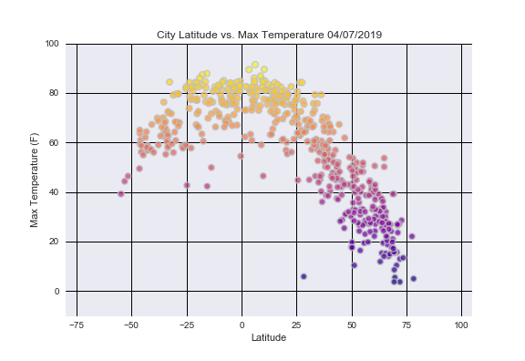
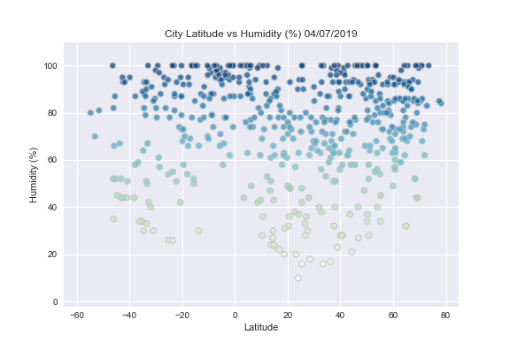
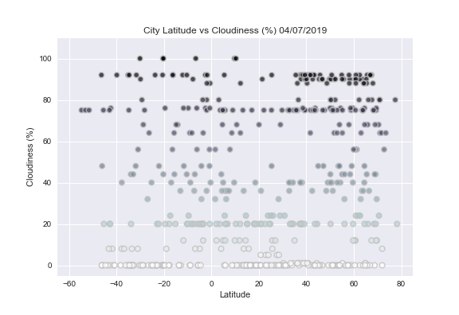
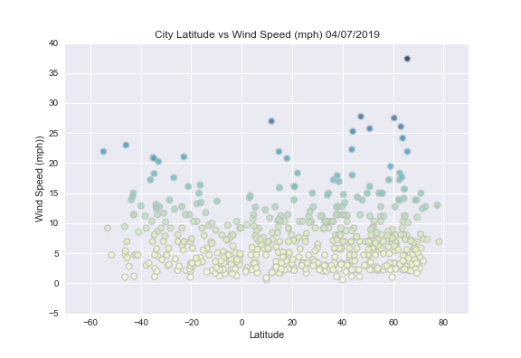

# Unit 6 | Assignment 
## WeatherPy- Observable Trends

Temperature (F) vs. Latitude Observation #1 
----------------------------------------------------------------------

As you move from left to right on this graph it is obivous that the data is normalized. There just happen to not be as many samples from below -50 degrees in the displayed data pull. This normalization implies that the closer you are to 0 degrees the higher Max Temps are.

* Humidity (%) vs. Latitude: Observation #2 

----------------------------------------------------------------------------------------------
One thing that stands out right away about this graph is the amount of clustering around -5 though 0 degrees and at 40 through 60 Latitude degrees. I have more high Humidity samples than lower. However, it does not appear that there is an obvious high humidity trend around the equator.

* Cloudiness (%) vs. Latitude: Observation #3

---------------------------------------------------------------------------------------------------

The distribution of points in this graph is fairly spread out. There are clear lines at Cloudiness (%)'s: 0, 20, 75
There is possible evidence that cities closer to the equator are less clowdy. There seems to be verry little clusters close to 0 degrees 

* Wind Speed (mph) vs. Latitude: Observation #4

---------------------------------------------------------------------------------------------------

