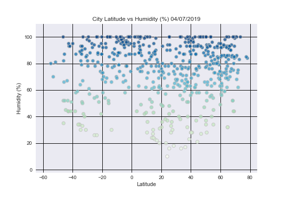
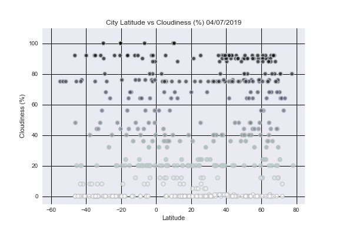
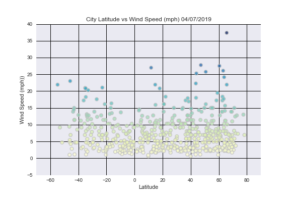

# Unit 6 | Assignment 
## WeatherPy

Observable Trends

* Temperature (F) vs. Latitude

observation #1: 

* Humidity (%) vs. Latitude

observation #2: 

* Cloudiness (%) vs. Latitude

observation #3: 

* Wind Speed (mph) vs. Latitude

observation #4: 

